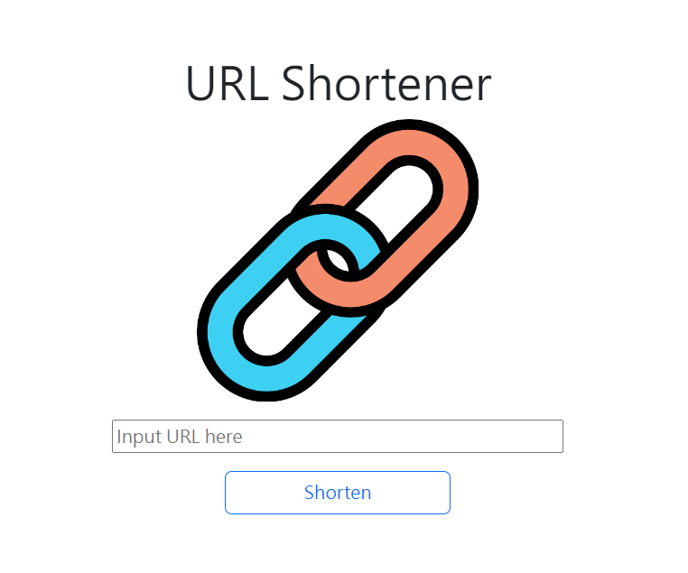

# 我的餐廳清單



## 介紹

將你落落長的網址縮小，然後可以透過此網址到達同樣的網站

### 功能

使用者將網址貼到輸入框，按下「Shorten」按鈕
即可產生對應的短網址
(同時剪貼簿中也存放該短網址，就不用再手動複製)

## 開始使用

1. 請先確認有安裝 node.js 與 npm
2. 在終端機輸入以下指令，將專案 clone 到本地
   ```bash
   git clone https://github.com/freeway26tw/url-shortener.git
   ```
   
3. 在本地開啟之後，透過終端機進入資料夾，輸入：

   ```bash
   npm install
   ```

   ps. 此時終端機上可能會出現「​​ high severity vulnerability 」的提示
   這是因為 express-handlebars 不是當前最新版本
   但此訊息不影響此專案的運作，因此可先忽略

4. 新增.env檔案，存放 MONGODB_URI=mongoDB+srv://[使用者帳號:使用者密碼]@[資料庫伺服器位置]/[資料庫名稱]

5. 使用種子資料:
   ```bash
   npm run seed
   ```

6. 安裝完畢後，繼續輸入：

   ```bash
   npm run dev
   ```

7. 若看見此行訊息則代表順利運行

   ```bash
   Express is listening on http://localhost:3000
   ```

8. 打開瀏覽器進入到以下網址，即可連到網頁
   ```
   http://localhost:3000/
   ```


9. 若欲暫停使用，可回到終端機輸入

   ```bash
   ctrl + c
   ```

## 開發工具

- Node.js 14.16.0
- Express 4.17.1
- Express-Handlebars 4.0.2
- Body-Parser: 1.20.1
- nanoid: 3.0.0
- Mongoose: 5.9.7